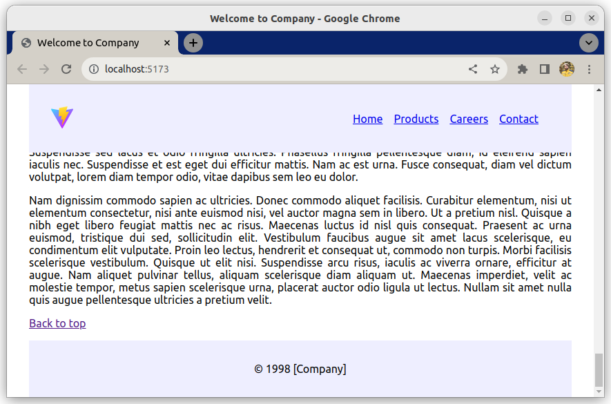

# Component Layouting exercise

This is an exercise about practicing thinking in Components.

## What you will be doing

Follow the tasks to create a website layout using components. Some of the code already exists, some of it you will have to code yourself.

### Example

## Tasks

### Task 1

- Move the `header` element into a new component; `Header.jsx`
- Move `Header.jsx` into the components folder
- Move `Header.css` into the components folder
- Make sure the page still works;
    - Add missing import/export statements
    - Make sure both images in the header still work

### Task 2

- Move the `main` element into a new component; `Main.jsx`
- Place `Main.jsx` into the components folder
- Add the import and export statements, Add `<Main />` into App
- Do not move `data.js`

### Task 3

- Import the Footer component into App
- Place a Footer element after `<Main />`

### Task 4

- Change the page title to "Welcome to Company"
- Create `Main.css` and justify the text of all paragraphs
- Add a link to the end of Main taking you to the top of the page
