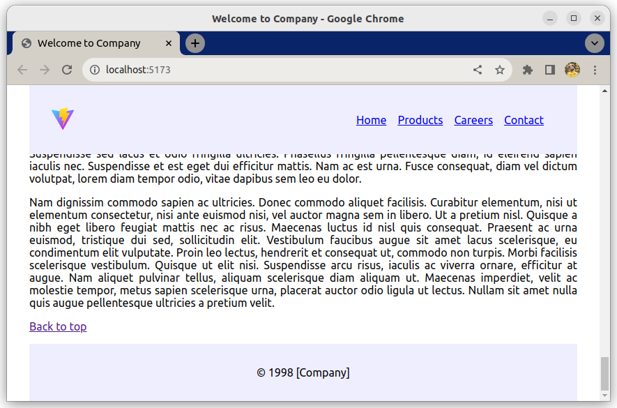

# Übung zum Layouten von Komponenten

Dies ist eine Übung, um das Denken in Komponenten zu üben.

## Was du machen wirst

Folge den Aufgaben, um ein Website-Layout mit Komponenten zu erstellen. Ein Teil des Codes existiert bereits, einen Teil davon musst du selbst codieren.

### Beispiel

## Aufgaben

### Aufgabe 1

- Verschiebe das `header` Element in eine neue Komponente; `Header.jsx`
- Verschiebe `Header.jsx` in den Ordner "components"
- Verschiebe `Header.css` in den Ordner "components"
- Stelle sicher, dass die Seite immer noch funktioniert;
    - Füge fehlende Import-/Export-Anweisungen hinzu
    - Stelle sicher, dass beide Bilder im Header immer noch funktionieren

### Aufgabe 2

- Verschiebe das `main` Element in eine neue Komponente; `Main.jsx`
- Platziere `Main.jsx` in den Ordner "components"
- Füge die Import- und Export-Anweisungen hinzu, füge `<Main />` in App ein
- Verschiebe `data.js` nicht

### Aufgabe 3

- Importiere die Footer-Komponente in App
- Platziere ein Footer-Element nach `<Main />`

### Aufgabe 4

- Ändere den Seitentitel in "Willkommen bei Company"
- Erstelle `Main.css` und richte den Text aller Absätze aus
- Füge am Ende von Main einen Link hinzu, der dich zum Anfang der Seite führt

## Hinweise

- Link zur MDN-Dokumentation
- Andere Hinweise
