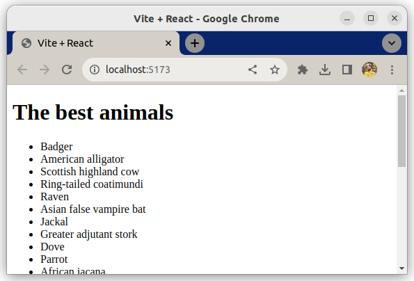

# React and Map

This exercise is about practicing `Array.prototype.map()` in React / JSX.

## What you will be doing

You will render a simple list of animals based on an existing data list and add basic styling.

### Example

## Tasks

### Task 1

- Create a new component: `AnimalList.jsx`
- `AnimalList` takes in a prop called `animals`
- Render `AnimalList` from `App`
- Give `animals` from `App` to `AnimalList` as a prop
- In `AnimalList`, render a `ul` element
- In the `ul`, use `map` to loop over all animals
- First, create a simple `li` and render the name of the animal
- Test that everything works and you see a list of animal names

### Task 2

- Create a new component: `AnimalListItem.jsx`
- `AnimalListItem` takes in a prop called `name` and `id`
- Render a `li` containing the name `name`
- Use the `id` of an animal as the key
- If the `name` contains a comma, display only the part before the comma
    - Instead of rendering `<li>Badger, honey<li>`, render `<li>Badger<li>`

### Task 3

- Import the `AnimalListItem` into `AnimalList`
- Use `AnimalListItem` instead of `li` in your `map()`
- Pass props `animal.name` as `name`, and `animal.id` as `id` 
