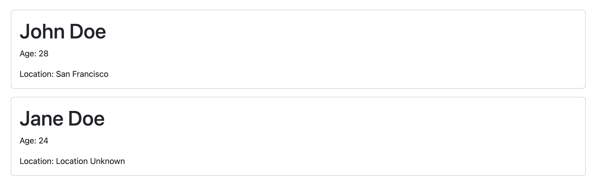

# User Profile Display with Conditional Rendering

This exercise helps you understand and use props to pass data from parent to child components and use conditional rendering based on these props.

## What you will be doing

You will be create a simple "User Profile" display. The display will show information about a user: their _name_, _age_, and _location_.

## Tasks

### Task 1 - Create the UserProfile Component

Create a `UserProfile` component which accepts `name`, `age`, and `location` as props. It should display the user's name and age.

### Task 2 - Implement Conditional Rendering

Inside the `UserProfile` component, use conditional rendering to;

- display the location, if the `location` prop was passed
- the string `"Location Unknown"` if the `location` prop was **not** passed

### Task 3 - Modify the App Component

The `App` component is your main component. Inside this component, render the `UserProfile` component at least two times and pass through the required props.

Example output:



## Bonus Task

Enhance your application's functionality by printing the details of all users in the following array (use `Array.prototype.map()`):

```js
[
  {"name":"Nelle Allardyce","age":40},
  {"name":"Godard Gercken","age":51},
  {"name":"Afton Nelle","age":118,"location":"Bukui"},
  {"name":"Delilah Lumm","age":70},
  {"name":"Magdaia Tufts","age":37,"location":"Bintawan"},
  {"name":"Meghann Bettenson","age":20,"location":"Néma"},
  {"name":"Amalia Every","age":42,"location":"Kaberamaido"},
  {"name":"Clywd Sarten","age":85,"location":"Fukadale"},
  {"name":"Lorilee Junkinson","age":55,"location":"Huangdi"},
  {"name":"Lexi Durnell","age":112,"location":"Stobreč"}
]
```

## Happy coding!
