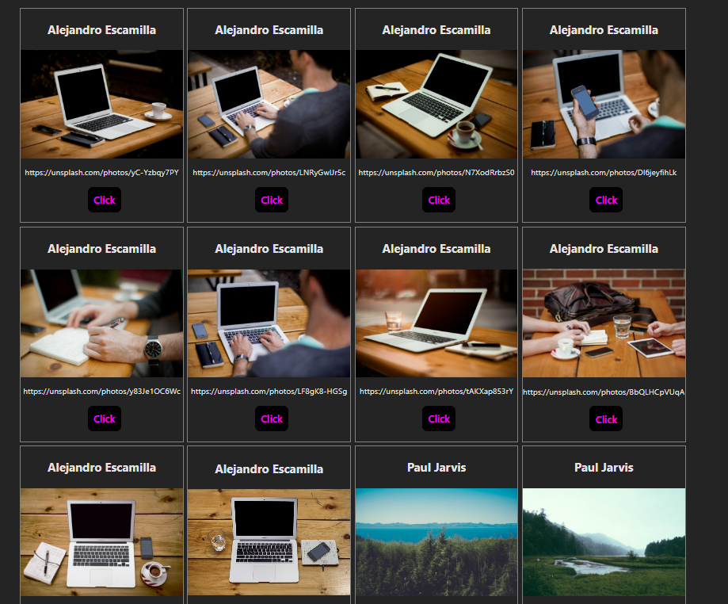

# Display Cards

[Step 1] Coding

- In `Cards.jsx`,
  fetch random 20 images from `https://picsum.photos/v2/list?limit=20`

- Store the fetched data (JSON array) in the state variable and map it

- each iterated object data will be displayed in the sub-component `Card.jsx`
    `h3` title (object's author)
    `img` as object's download_url
    `p` as object`s url 

[Step 2] Styling

- install styled-components `npm i styled-components`

- use styled-components for
  - in `Cards.jsx`: `Wrapper`
  - in `Card.jsx`: `CardWrapper`, `Button`

