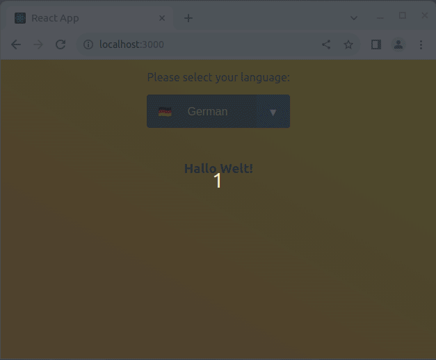

# Language chooser

This exercise is about practicing `useContext`.

You are tasked with creating a website language chooser demonstration.

## Example



## Tasks

Structure your app as follows:

  - `App` has Header and Content as children

    - `Header`
    - `Content`

In `Header.jsx`:
- Display a dropdown selection, where the user can choose between different languages (use `select` and `option` elements)

In `Content.jsx`:
- Show a message in the chosen language

  - DE: "Hallo Welt!"
  - EN: "Hello World!"
  - Feel free to add other languages :)
  - **HINT** store the languages in an object, then you can access one of them with a bracket notation depending on the chosen `option` value
 
``` js
const messages = {
EN: "Hello World!".
DE: "Hallo Welt!"
}
 ```

- If the user changes the language settings, the message should be updated accordingly
- Style doesn't really matter


