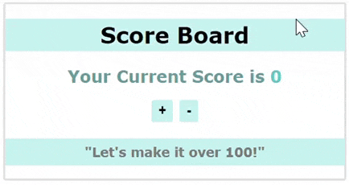

# Create a simple Scoreboard using Context API

In this exercise, we will practice how to share data across the components by using Context API. See the reference image below.

## Tasks

### Task 1

Create a new react vite app;

- create and run the vite app
- clean up the default contents from `App.jsx`
- Inside the `src` folder, create a new folder called `Components`

### Task 2

- Create the component `Scoreboard.jsx` inside the `Components` folder
- Add some content like in the image above, including `h2` to display the current score
- Add two buttons (+, -)
- Import the `Scoreboard` component in `App.jsx`

### Task 3

Inside the `src` folder

- Create a new folder called `Contexts`
- Add `ScoreContext.jsx` to the `Contexts` folder

> Note that we initialize the context in a separate file and use it across the entire app

### Task 4

In `ScoreContext.jsx`

- Create and export a Context called `ScoreContext`
- Create and export a Context Provider component called `ScoreContextProvider`

### Task 5

- Inside the `ScoreContextProvider`, declare a state variable called `score` with an initial value of `0`, and
- Write two functions:
  - `plusScore(): score + 10`
  - `minusScore(): score - 10`
- Use the `value` prop to make these three variables (`score`, `plusScore`, `minusScore`) accessible to all child components

### Task 6

In `App.jsx`;

- Import the `ScoreContextProvider` component
- To make the context accessible to the child components, wrap the `Scoreboard` component with the `ScoreContextProvider` component

### Task 7

Time to consume the ScoreContext. In `Scoreboard.jsx`:

- Import `useContext` from react.
- Import `ScoreContext` from the `Contexts` folder
- Access the value passed down from the context. Use the value `score` from the context for the `h2` text
- Connect the functions `plusScore`, `minusScore` to onClick events of the buttons

### Task 8

- Inside the `Components` folder, create the component `Infoboard` and import it in `App.jsx`
- Add a `h3` element with the text **"Let's make it over 100!"**
- The content should change to **"Good job!"** once the score is over `100`. Utilize `score` value from the context.
